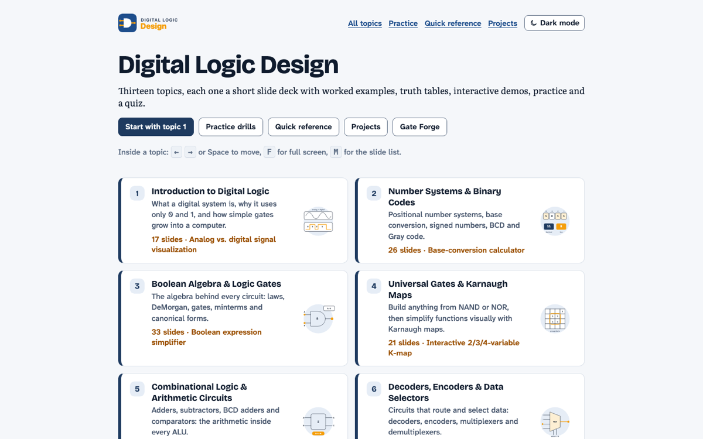
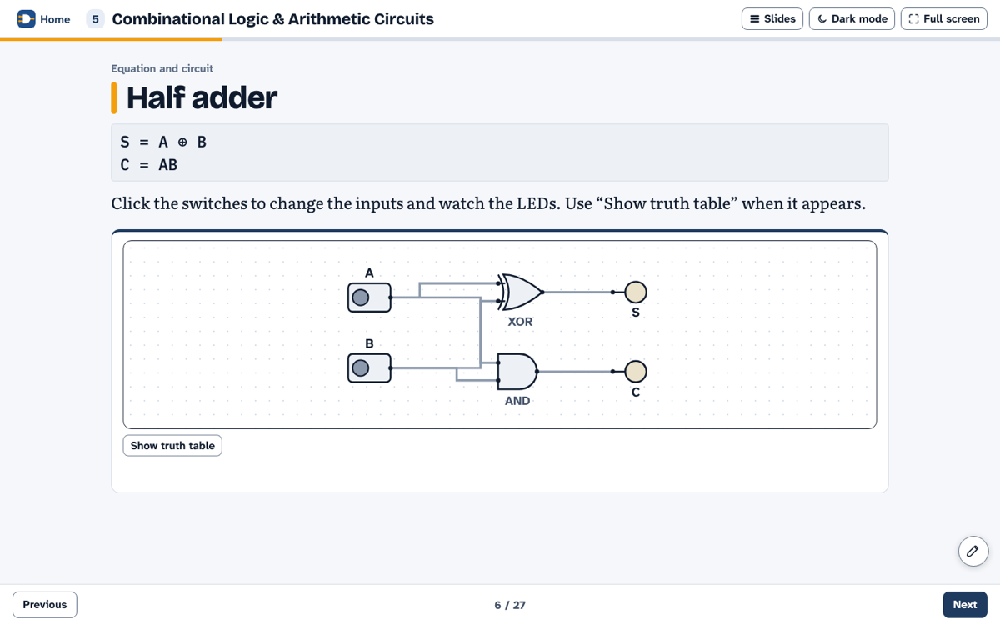

<div align="center">


# CSE 203 · Digital Logic Design

**Interactive slide-deck course notes for Digital Logic Design.**

<a href="https://ayan-1829.github.io/CSE-203-Digital-Logic-Design/"></a>


### [🌐 Open the live site →](https://ayan-1829.github.io/CSE-203-Digital-Logic-Design/)

</div>

<br>

<p align="center"> </p>

<p align="center"><a href="https://ayan-1829.github.io/CSE-203-Digital-Logic-Design/practice.html">Practice and drills</a> · <a href="https://ayan-1829.github.io/CSE-203-Digital-Logic-Design/reference.html">Quick reference</a> · <a href="https://ayan-1829.github.io/CSE-203-Digital-Logic-Design/projects.html">Projects</a></p>

## ✨ Highlights

<table>
<tr><td width="50%" valign="top">🧭&nbsp; 13 topic decks, from number systems and Boolean algebra to counters, memory and programmable logic</td><td width="50%" valign="top">🔍&nbsp; Clickable circuits, K-map and Quine–McCluskey tools, and a live circuit simulator (Gate Forge)</td></tr>
<tr><td width="50%" valign="top">🧩&nbsp; Worked examples, real-life gate examples and a quiz in every topic</td><td width="50%" valign="top">📝&nbsp; Drills, practice problems, a searchable reference and project checklists</td></tr>
</table>

## 📚 Topics

13 decks · 277 slides. Each title opens the live deck.

| # | Topic | Slides |
|:--:|---|:--:|
| **1** | [Introduction to Digital Logic](https://ayan-1829.github.io/CSE-203-Digital-Logic-Design/topics/01-introduction.html) | 17 |
| **2** | [Number Systems & Binary Codes](https://ayan-1829.github.io/CSE-203-Digital-Logic-Design/topics/02-number-systems.html) | 26 |
| **3** | [Boolean Algebra & Logic Gates](https://ayan-1829.github.io/CSE-203-Digital-Logic-Design/topics/03-boolean-algebra-and-gates.html) | 33 |
| **4** | [Universal Gates & Karnaugh Maps](https://ayan-1829.github.io/CSE-203-Digital-Logic-Design/topics/04-universal-gates-and-k-maps.html) | 21 |
| **5** | [Combinational Logic & Arithmetic Circuits](https://ayan-1829.github.io/CSE-203-Digital-Logic-Design/topics/05-combinational-logic.html) | 27 |
| **6** | [Decoders, Encoders & Data Selectors](https://ayan-1829.github.io/CSE-203-Digital-Logic-Design/topics/06-decoders-encoders-mux.html) | 19 |
| **7** | [Sequential Logic: Latches & Flip-Flops](https://ayan-1829.github.io/CSE-203-Digital-Logic-Design/topics/07-latches-and-flip-flops.html) | 23 |
| **8** | [State Machines & Sequential Circuit Design](https://ayan-1829.github.io/CSE-203-Digital-Logic-Design/topics/08-state-machines.html) | 18 |
| **9** | [Counters](https://ayan-1829.github.io/CSE-203-Digital-Logic-Design/topics/09-counters.html) | 27 |
| **10** | [Registers](https://ayan-1829.github.io/CSE-203-Digital-Logic-Design/topics/10-registers.html) | 16 |
| **11** | [Memory & Error Correction](https://ayan-1829.github.io/CSE-203-Digital-Logic-Design/topics/11-memory.html) | 17 |
| **12** | [ROM & Programmable Logic](https://ayan-1829.github.io/CSE-203-Digital-Logic-Design/topics/12-rom-and-programmable-logic.html) | 17 |
| **13** | [Digital Systems & Practice](https://ayan-1829.github.io/CSE-203-Digital-Logic-Design/topics/13-digital-systems.html) | 16 |

## ⌨️ Using the slides

| Key | Action |
|:--:|---|
| <kbd>←</kbd> <kbd>→</kbd> · <kbd>Space</kbd> | previous / next slide |
| <kbd>Home</kbd> · <kbd>End</kbd> | first / last slide |
| <kbd>F</kbd> | full screen for teaching |
| <kbd>M</kbd> | slide list |
| ✏️ | draw on any slide |

The address bar shows `#s=N`, so you can link straight to a slide. Light and dark themes follow your system, with a toggle in the header.

## 🚀 Run it locally

No build step, no server: clone the repository and open `index.html` in any modern browser.

```bash
git clone https://github.com/Ayan-1829/CSE-203-Digital-Logic-Design.git
open CSE-203-Digital-Logic-Design/index.html      # macOS · use start on Windows, xdg-open on Linux
```

<details>
<summary><b>🛠 Developer notes: folder layout and how the pages are built</b></summary>

```text
Folder layout
-------------
index.html                     list of topics (kept at the site root)
topics/01-introduction.html …  one HTML file per topic (13 topics), each made of <section class="slide"> elements
practice.html                  drills, all practice problems, link to Gate Forge
reference.html                 searchable formulas and tables
projects.html                  project checklists, 3x3 multiplier, viva questions
css/style.css                  all styling (colour, font and font-size tokens are at the top of the file)
img/                            logo (logo.svg, logo-mark.svg), favicons, and the homepage tool-card images
js/core.js                     helpers, Boolean parser, Quine-McCluskey minimiser, gate shapes
js/lab.js                      small circuit simulator used by the "circuit" slides
js/kmap.js                     K-map component
js/demos.js                    the interactive demos for each topic
js/reallife.js                 real-life gate examples and the series/parallel switch analogy
js/quiz.js                     quiz widget
js/slides.js                   slide engine: keys, swipe, slide list, progress, full screen
js/extras.js                   drills, quick reference and project helpers
js/analytics.js                shared cookieless analytics tracker (do not edit; same file in every project)
js/course-events.js            course events for the Course analytics Sheet: slide titles, quizzes, tools, answers
robots.txt, sitemap.xml        SEO crawling files for https://ayan-1829.github.io/CSE-203-Digital-Logic-Design/
site.webmanifest, 404.html     web-app manifest and GitHub Pages "not found" page
img/og/                        1200x630 social-share image for every page
DEVLOG.md                      running log of changes made to this site, with the prompt used for each update

Files inside topics/ reference the shared css/ and js/ folders and index.html
one level up (e.g. "../css/style.css", "../index.html"), since they live in
their own subfolder. Topic-to-topic links (e.g. topic 1 -> topic 2) stay as
plain filenames because both files are siblings inside topics/.

Using the slides
----------------
Arrow keys / Page Up / Page Down / Space   move between slides
Home / End                                 first / last slide
F                                          full screen (falls back to presentation mode where the browser has no full-screen API)
M                                          slide list (each topic slide is listed by title)
Esc                                        close the slide list
Touch: swipe left or right on empty parts of a slide.
The address bar shows #s=N for slide N, so you can link straight to a slide.

Fonts and text sizes
--------------------
Four fonts, one job each: Bricolage Grotesque (headings), Literata (reading text),
Atkinson Hyperlegible Next (buttons, labels, tables, diagram labels), IBM Plex Mono (bits, code, equations).
Use only the five size tokens: var(--fs-sm) (smallest allowed), --fs-base, --fs-md, --fs-lg, --fs-xl.
On slides they scale with screen width so the back row can read them (--fs-sm is about 22px at 1280 wide).
In SVG diagrams give labels class="lt" (12.5 units) and size the <svg> with
style="width:100%;max-width:calc(<viewBox width> * var(--u))" so a 12.5-unit label matches --fs-sm.

Adding or editing a slide
-------------------------
Inside a topic file, a slide is just:

  <section class="slide" data-title="Name shown in the slide list" aria-label="Name shown in the slide list" tabindex="-1">
    <div class="slide-inner">
      <h2>Heading</h2>
      <p>Text...</p>
    </div>
  </section>

Copy an existing <section>, edit the text and save. The slide counter and the slide list update automatically.

Placeholders that become interactive
------------------------------------
<div data-demo="3" data-part="0"></div>      demo number 3 (topic number), panel 0 (see js/demos.js, DEMOS[3])
<div data-circuit="half-adder"></div>        a clickable example circuit (names are in PRESETS in js/lab.js)
<div data-reallife="AND"></div>              real-life gate slide (texts are in REAL_LIFE in js/reallife.js)
<div data-switch-analogy></div>              series/parallel switch drawing
<div data-gates></div>                       row of gate symbols
<div class="quiz-host" data-quiz-key="3"></div> + <script type="application/json" class="quiz-json">[...]</script>
```

</details>

## 🎓 All courses

| | Course | Live site | Repository |
|:--:|---|:--:|:--:|
|  | **CSE 201** · Object Oriented Programming | [Open](https://ayan-1829.github.io/CSE-201-Object-Oriented-Programming/) | [GitHub](https://github.com/Ayan-1829/CSE-201-Object-Oriented-Programming) |
|  | **CSE 202** · Object Oriented Programming Lab | [Open](https://ayan-1829.github.io/CSE-202-Object-Oriented-Programming-Lab/) | [GitHub](https://github.com/Ayan-1829/CSE-202-Object-Oriented-Programming-Lab) |
|  | **CSE 203** · Digital Logic Design **(this one)** | [Open](https://ayan-1829.github.io/CSE-203-Digital-Logic-Design/) | [GitHub](https://github.com/Ayan-1829/CSE-203-Digital-Logic-Design) |
|  | **CSE 308** · Design Project I | [Open](https://ayan-1829.github.io/CSE-308-Design-Project-I/) | [GitHub](https://github.com/Ayan-1829/CSE-308-Design-Project-I) |

---

<p align="center">Made by <b>Ayan Sarkar</b> · Green University of Bangladesh</p>
